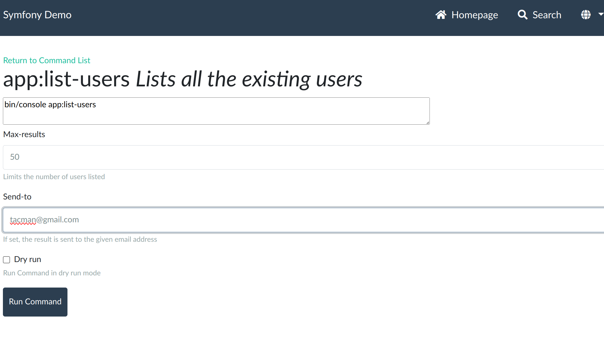
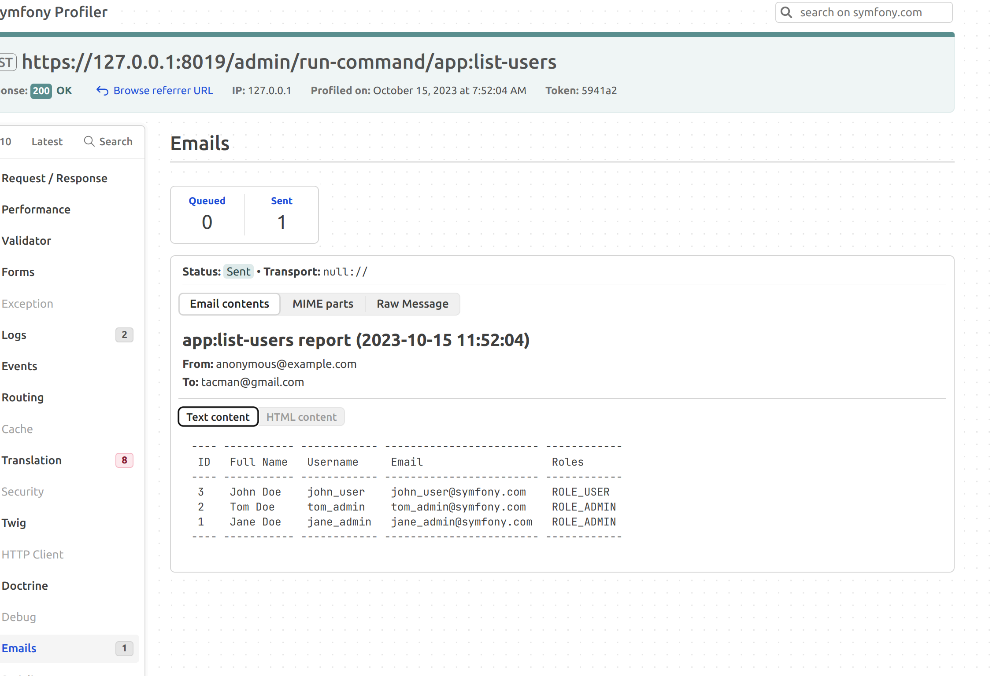

# Command Bundle

Run Symfony command line programs from a web interface, for easier debugging.

## Purpose

Use assert(), dump() and dd() are quick and easy debug tools when debugging a Symfony web page.  But it's often difficult to use with console commands.

For example, in the official Symfony Demo, there is a command to send the list of users to an email address.

```bash
bin/console app:list-users --send-to=admin@example.com
```

Debugging this is much easier with Symfony's Debug Toolbar, so make it available by adding this bundle.

```bash
composer req survos/command-bundle
```

Now go to /admin/commands and see what's available


Select list-users, and fill in the email.



Submit the form and open the debug toolbar:



With dumps and asserts, this is even more helpful.


## Example with Symfony Demo

```bash
symfony new --demo command-demo && cd command-demo
# bump to the latest version of Symfony 6.3, use whatever version of you have installed
sed -i 's/"php": "8.1.0"//' composer.json 
composer config extra symfony.require "^6.3"
composer config extra.symfony.allow-contrib true
composer update 
# allow recipes, waiting for PR approval
export SYMFONY_ENDPOINT=https://raw.githubusercontent.com/symfony/recipes-contrib/flex/pull-1548/index.json

composer req survos/command-bundle
```

Now go to /admin/commands

## Using Invokable Commands

I love zenstruck's extra-console, which allows defining the arguments and options via attributes, so you can create smaller console commands.  This bundle (command-bundle) already uses extra-console, so this works with no further installation.

Here's a command that lists the posts.

```bash
cat > src/Command/ListPostsCommand.php <<END
<?php

namespace App\Command;

use App\Entity\Post;
use App\Entity\Tag;
use App\Repository\PostRepository;
use Symfony\Component\Console\Attribute\AsCommand;
use Symfony\Component\Console\Style\StyleInterface;
use Symfony\Component\PropertyAccess\PropertyAccessorInterface;
use Zenstruck\Console\Attribute\Option;
use Zenstruck\Console\ConfigureWithAttributes;
use Zenstruck\Console\InvokableServiceCommand;
use Zenstruck\Console\IO;
use Zenstruck\Console\RunsCommands;
use Zenstruck\Console\RunsProcesses;

#[AsCommand('app:list-posts', 'List the posts')]
final class ListPostsCommand extends InvokableServiceCommand
{

    use ConfigureWithAttributes;
    use RunsCommands;
    use RunsProcesses;


    public function __invoke(
        IO                        $io,
        PostRepository            $postRepository,
        PropertyAccessorInterface $accessor,
        StyleInterface $symfonyStyle,
        #[Option(description: 'Limit the number of posts')]
        int                       $limit = 50
    ): void
    {

        $headers = ['id', 'title', 'author', 'tags', 'comments'];
        $createUserArray = static function (Post $post) use ($headers, $accessor) {
            //
            return array_map(fn($header) => match ($header) {
                'author' => $post->getAuthor()->getFullName(),
                'tags' => join(',', $post->getTags()->map(fn(Tag $tag) => $tag->getName())->toArray()),
                'comments' => $post->getComments()->count(),
                default => $accessor->getValue($post, $header)
            }, $headers);
        };

        $criteria = [];
        $posts = array_map($createUserArray, $postRepository->findBy($criteria, [], $limit));
        $symfonyStyle->table($headers, $posts);
    }
}
END
```
