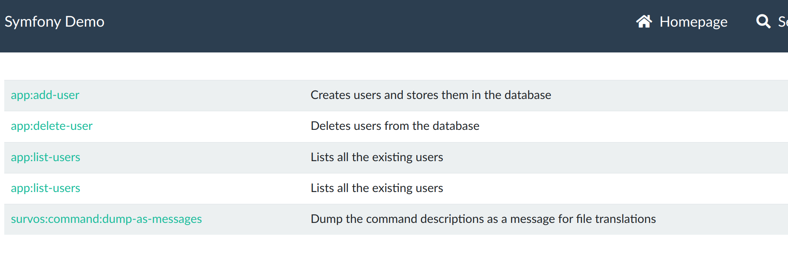

# Command Bundle

Run Symfony command line programs from a web interface, for easier debugging.

## Purpose

Use assert(), dump() and dd() are quick and easy debug tools when debugging a Symfony web page.  But it's often difficult to use with console commands.

For example, in the official Symfony Demo, there is a command to send the list of users to an email address.

```bash
bin/console app:list-users --send-to=admin@example.com
```

Debugging this is much easier with Symfony's Debug Toolbar, so make it available by adding this bundle.

```bash
composer req survos/command-bundle
```

Now go to /admin/commands and see what's available



Select list-users, and fill in the email.


Submit the form and open the debug toolbar:


With dumps and asserts, this is even more helpful.


## Example with Symfony Demo

```bash
symfony new --demo command-demo && cd command-demo
# bump to the latest version of Symfony 6.3, use whatever version of you have installed
sed -i 's/"php": "8.1.0"//' composer.json 
composer config extra symfony.require "^6.3"
composer config extra.symfony.allow-contrib true
composer update 
# allow recipes
export SYMFONY_ENDPOINT=https://raw.githubusercontent.com/symfony/recipes-contrib/flex/pull-1548/index.json

composer req survos/command-bundle
```

Now go to /admin/commands

